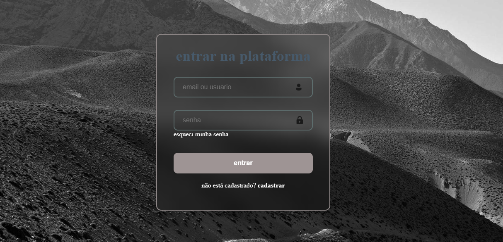
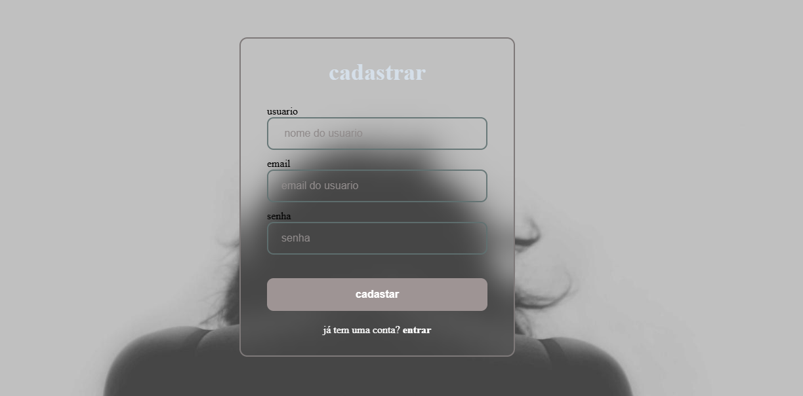

# 🔐 Sistema de Login e Cadastro - Flask

Projeto simples de **Login e Cadastro de Usuários** desenvolvido para estudo de **Back-End com Python e Flask**.

---

## 📌 Sobre o Projeto

Este projeto simula o funcionamento básico de autenticação de usuários, permitindo:

* Criar conta
* Fazer login
* Verificação básica de usuário e senha (sem banco de dados)
* Navegação entre telas

Objetivo: praticar conceitos de **Back-End**, rotas HTTP e organização de projetos web.

---

## 🚀 Tecnologias Utilizadas

* Python
* Flask
* HTML5
* CSS3

---

## 📂 Estrutura do Projeto

projeto-login/
│
├── loginAPP.py
├── README.md
├── .gitignore
│
├── templates/
│   ├── login.html
│   └── cadastro.html
│
├── static/
│   └── style.css
│
└── assets/
    ├── login.png
    └── cadastro.png

---

## ⚙️ Como Executar o Projeto

### 1️⃣ Clonar o repositório

```
git clone https://github.com/adrianosouza-dev/_login
```

### 2️⃣ Entrar na pasta

```
cd projeto-login
```

### 3️⃣ Instalar dependências

```
pip install flask
```

### 4️⃣ Rodar o servidor

```
python loginAPP.py
```

Depois abra no navegador:

```
http://127.0.0.1:5000
```

---

## 🧠 Conceitos Praticados

* Rotas Flask
* Métodos HTTP (GET / POST)
* Templates HTML
* Formulários Web
* Organização MVC básica

---

## 📷 Preview

### tela de login


### tela de cadastro


---

## 👨‍💻 Autor

Adriano Souza
Estudante de Desenvolvimento Back-End
